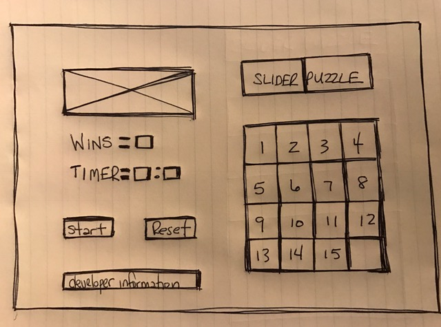

**Game:** 
Slider Puzzle  

**Goal of game:** 

1. The numbers will not be in order on start 

2. Click a number next to the empty box... it will move up, down, left, or right 

3. The winning number order is left to right from 1-15  

**Board features:** 

1. Buttons change color and make a clicking sound as you select them 

2. Timer runs so you can see how quickly you win 

3. Restart button restarts the game and timer 

4. Share with your friends on Facebook, Twitter, and linkedIn  

**Installation instructions:** 

1. Clone from the Github repository 

2. Open in your web browser 

3. HAVE FUN!  

**Approach taken:** 

1. Coded 16 buttons first with a slide function but ended with a table layout 

2. Coded layout runs center so it displays better on mobile, stuck with 4 colors 

3. Coded restart button and timer UP, the button resets both the game and timer 

4. Coded links to view my other projects and share buttons to social media  

**Unsolved challenges:** 

1. Empty box background is a different color 

2. Only valid moves change color on hover and make the clicking sound 

3. Make different size boards selected with a button (Small: 3x3 Large: 6x6)  

**Technologies used:** 

1. CSS 

2. HTML 

3. Javascript 

4. jQuery  

**Repository:** 
<https://github.com/Brian60657/slider_puzzle>  

**User stories:** 
<https://trello.com/b/H8tPJaYk/slider-puzzle>  

**Wireframe:** 
  
